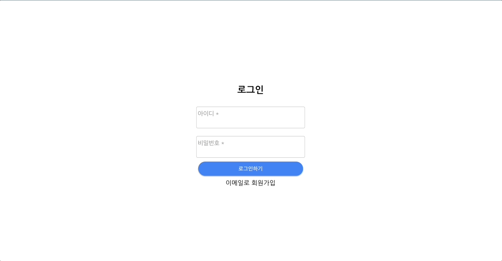
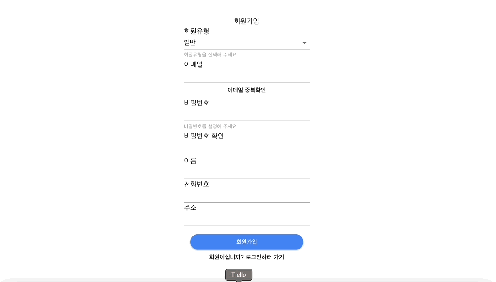
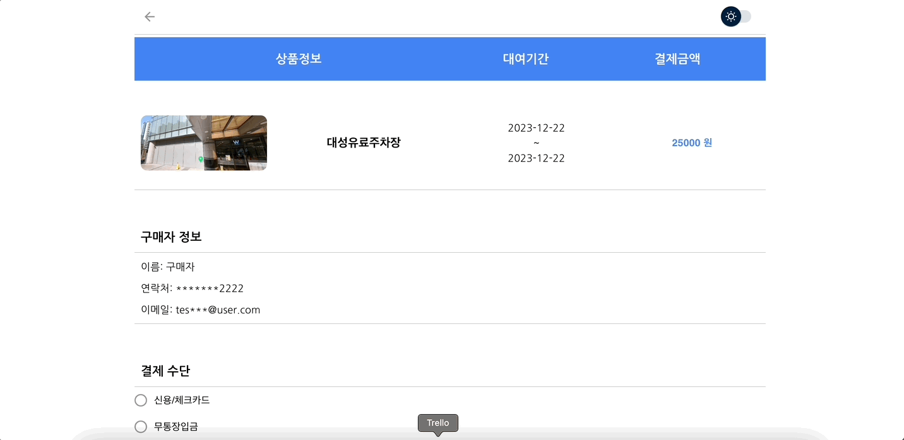

<div align=center>
	<span id="top">
	<h1>🅿️ 마이파킹</h1><br>


<h3>도심 속 주차장 예약 서비스🚙 🛻</h3><br>

<b>[마이파킹 앱 바로가기](https://my-parking.netlify.app/)</b> <br>

<b>일반회원</b>
Test ID : `test@user.com` <br>
Test PW : `user1234!` <br>

<b>판매회원</b>
Test ID : `test@seller.com` <br>
Test PW : `seller1234!` <br>

<br> 
</div>

---

## <span id="intro">서비스 소개</span>

<b>'마이파킹(MyParking)'</b>은 주차장을 필요한 사람과 판매하고 싶은 사람들간의 사고파는 장을 만들어 주어 쉽게 교류 할 수 있는 공유/대여 서비스입니다.<br>

- 전국 어디서든 원하는 날짜와 위치를 찾아보고 주차장을 예약할 수 있습니다.
- 위치와 날짜검색을 통해 당장 내가 필요한 주차장을 파악할 수 있습니다.
- 장시간 사용하지 않는 주차장을 등록해서 부가 수익을 창출할 수 있습니다.
- (추후) 예약자와 판매자 간의 소통을 통해 원활하게 주차장을 예약할 수 있습니다.

<br><br>

## <span id="team">팀 소개</span>

### 이삼솨팀을 소개합니다!

<br/>
<div align="center">

|                                                                  **강수암**                                                                   |                                                                   **이현걸**                                                                    |                                                                  **이수아**                                                                  |
| :-------------------------------------------------------------------------------------------------------------------------------------------: | :---------------------------------------------------------------------------------------------------------------------------------------------: | :------------------------------------------------------------------------------------------------------------------------------------------: |
|                                                         |                                                                             |                                                             |
| <a href="https://github.com/SuamKang"></a><br/> | <a href="https://github.com/Hyungeol94"></a><br/> | <a href="https://github.com/suconpa"></a><br/> |
|                                     - 개발환경 세팅 및 라우터 설정 <br/> - Product 개발 <br/> - Map 기능                                      |                              - Search, MyPage, Signup 개발 <br/> - Zustand Slice Pattern초기 세팅 <br/> - Map 기능                              |                                         - purchase,reply,Login 개발 <br/> - MUI 적용, 다크모드 개발                                          |

</div>

<br/><br/>

## <span id="team">기술 및 개발환경</span>

#### 언어 및 라이브러리


#### 빌드 및 배포


#### 스타일


#### 협업 및 버전관리


#### 오픈소스 API


<br/>

## <span id="schedule">개발 일정</span>

<div align="center">
	
</div>

<br/>

## <span id="roles">역할 분담</span>

### 강수암

🎨 UI

- 상품 등록, 수정 페이지
- 상품 리스트, 상세 페이지
- 홈 페이지
- 랜딩 및 에러페이지

  <br>

💡 기능 구현

- 상품 CRUD
- 카카오 지도 API

  - 좌표 받아오고 위치 등록하기
  - 현재 위치 받아오기
  - 오버레이 적용 후 게시글 렌더링

  <br>

🤝 기타

- 프로젝트 아이디어의 기획 도출
- 지도 api 자료조사
- axios 인스턴스 설정
- 초기 개발환경 세팅
- 빌드 및 배포

<br>

### 이현걸

🎨 UI

- 회원가입 페이지
- 마이 페이지

 <br>

💡 기능 구현

- 회원 가입 및 유효성 검사, 토큰 관리
- 마이 프로필 등록 및 수정
- 카카오 지도 API
  - 키워드 및 날짜 검색 구현

 <br>

🤝 기타

- 데일리 스크럼, 회의록 작성 및 관리
- 전역 상태관리 설정
- 지도 api 코드 최적화

  <br>

### 이수아

🎨 UI

- 로그인 페이지
- 주문 목록 및 상세 페이지
- 결제 페이지
- 후기 페이지
- 레이아웃(헤더 푸터)
- 반응형 설정

  <br>

💡 기능 구현

- 로그인 유효성 검사 및 토큰 전역 관리
- 주문 목록 조회 및 상세 조회
- 후기 작성
- 결제 적용

   <br>

🤝 기타

- 프로젝트 디자인 관리(피그마)
- MUI 초기 설정 및 적용
- 다크모드 지정

<br><br>

## <span id="tree">프로젝트 구조</span>

```
🚙 my-parking-app
├─ public
├─ src
│  ├─ components : 재사용을 위해 기능이 담긴 컴포넌트
│  │  ├─ UI : 공통으로 사용되는 UI 컴포넌트
│  │  ├─ common : 특정 도메인이 아닌 컴포넌트
│  │  │  └─ map : 지도 관련 컴포넌트
│  │  ├─ domain
│  │  │  ├─ auth : 인증, 유저 관리 컴포넌트
│  │  │  ├─ my-services : 회원기능 관련 컴포넌트
│  │  │  ├─ order-history : 주문기능 관련 컴포넌트
│  │  │  ├─ product: 상품기능 관련 컴포넌트
│  │  │  ├─ purchase : 구매기능 관련 컴포넌트
│  │  │  └─ reply : 후기기능 관련 컴포넌트
│  │  └─ layouts: 레이아웃 컴포넌트
│  ├─ pages : 라우팅 처리를 위한 페이지 컴포넌트
│  ├─ router : 최상위 라우터 관리 폴더
│  ├─ services : 공통 API 로직 폴더
│  ├─ store : zustand 전역 상태관리 폴더
│  ├─ types : 타입 정의 폴더
│  ├─ assets : 정적파일 폴더
│  ├─ App.module.css
│  ├─ App.tsx
│  ├─ index.css
│  ├─ main.tsx
│  └─ vite-env.d.ts
├─ tsconfig.json
├─ tsconfig.node.json
└─ vite.config.ts
```

<br/><br/>

## <span id="schedule">페이지 미리보기</span>

**로그인 및 회원가입**





<br/>

**메인 서비스**


<br/>

**상품 등록**


<br/>

**상품 상세조회 및 수정 삭제**


<br/>

**결제 및 주문기록 후기**



<br><br>

## <span id="issues">핵심 코드</span>

### API 모듈 Axios

Axios를 사용하여 API 요청을 처리했으며, axios인스턴스를 적용하여 모든 axios요청에대한 공통 config를 적용하고 인터셉트를 추가하여 요청하고 응답받아오는 작업에 대한 전처리 후처리를 진행했습니다.
대표적으로 토큰 유효기간이 만료되었을시, 리프래쉬토큰을 가지고 다시 토큰을 발급받는 로직을 추가하였습니다.

```typescript
import axios from "axios";
import mem from "mem";
import { BASE_URL } from "./BaseUrl";

// 리플래쉬 토큰 앤드포인트 경로
const REFRESH_URL = "/users/refresh"; // 리프래쉬 토큰을 서버에 보내는 주소 -> 서버에서 새로운 엑세스 토큰 보내줌

...

const instance = axios.create({
    baseURL: BASE_URL,
    timeout: 1000 * 5,
    headers: {
      "Content-Type": "application/json",
      accept: "application/json",
    },
    withCredentials: true,
  });

// 요청 인터셉트
  instance.interceptors.request.use(
    (config) => {
      // 요청 전 토큰이 유효한지 리프래쉬토큰 검증 절차 진행
      // console.log(config.url);
      let token = userAccToken;
      if (config.url === REFRESH_URL) {
        // 요청을 보내는 객체 안에 리프래쉬토큰을 전달할 api주소가 있다면, 기존 받아온 리프래쉬 토큰 저장
        token = userRefToken;
      }
      config.headers["Authorization"] = `Bearer ${token}`;
      return config;
    },
    (error) => {
      console.error("interceptors error", error);
      return Promise.reject(error);
    }
  );

  // 응답 인터셉터
  instance.interceptors.response.use(
    (response) => {
      // console.log(response);
      return response;
    },
    async (error) => {
      console.error("interceptors error", error);

      const { config, response } = error;

      if (response?.status === 401) {
        // 응답 에러 메시지가 TokenExpiredError이거나 요청에 리프래쉬토큰 보내는 주소api가 아니면 재발급을 진행합니다.
        if (
          response.data.errorName === "TokenExpiredError" &&
          config.url !== REFRESH_URL
        ) {
          console.log("accessToken 만료. 재발급이 필요합니다.");
          const accessToken = await getAccessToken(instance);

          if (accessToken) {
            // 새롭게 전달받은 엑세스토큰을 에러에서 나온 config 헤더 오더라이제이션에 다시 담아줍니다.
            config.headers.Authorization = `Bearer ${accessToken}`;

            // 주스탄드user 상태값도 업데이트 해줍니다.
            setUser(
              {
                accessToken: accessToken,
                refreshToken: userRefToken,
              },
              user
            );
            // 기존 axios 설정값을 가지고 재요청
            return axios(error.config);
          }
        } else {
          // 리플래쉬 토큰마저 만료될경우에
          alert("다시 로그인이 필요합니다.");
          logout();
          navigate("/login");
        }
      } else if (response?.status === 404) {
        // 404오류뜨면 에러페이지로 이동시키기
        navigate("/error");
      } else {
        const error = response?.data?.error;
        // Network error 같은 경우 response가 없거나 서버에서 error를 응답한 경우
        if (!response || error) {
          alert(
            error?.message ||
              `요청하신 작업처리에 실패했습니다. 잠시후 다시 요청하시기 바랍니다.`
          );
        } else {
          return Promise.reject(error);
        }
      }
    }
  );

  // AccessToken 재발급
  const getAccessToken = mem(
    async function (instance) {
      try {
        const {
          data: { accessToken },
        } = await instance.get(REFRESH_URL);

        return accessToken;
      } catch (error) {
        console.error(error);
        alert("다시 로그인이 필요합니다.");
      }
    },
    { maxAge: 1000 }
  );

  return instance;

```

<br>

### 카카오 지도 api

저희 서비스의 핵심인 지도 라이브러리 적용을 위해 카카오에서 제공하는 함수와 메서드를 적용했고, SDK에서 제공하는 컴포넌트를 필요에따라 적용시켰습니다. 사용자의 현위치에 대해서 주차장을 볼 수 있도록 마커를 등록했으며, 해당 데이터를 함께 불러올 수 있도록 세팅하였습니다.

```typescript
//상품 검색에 필요한 정보(searchInfo)를 변경하고, 사용자의 검색 의도에 따라 조건적으로 지도를 움직이는 함수
  const handleSearch = () => {
    ...

    //검색어 입력값이 있는 경우, 지도를 이동한 후 상품 검색
    const ps = new kakao.maps.services.Places(map);
    ps.keywordSearch(`${searchRef.current.value}`, placeSearchCB);

    function placeSearchCB(
      result: kakao.maps.services.PlacesSearchResult,
      status: kakao.maps.services.Status
    ) {
      if (!map) return;
      if (status === kakao.maps.services.Status.OK) {
        const data = result[0]; // 가장 유사한 상위검색객체 저장
        //지도의 중심 좌표 이동
        map.setCenter(new kakao.maps.LatLng(Number(data.y), Number(data.x)));

        //지정한 영역이 가장 잘 보이는 최적의 지도 중심 좌표와 레벨이 지정
        // const bound = new kakao.maps.LatLngBounds(); // 지도 영역생성 -> 사각형
        // bound.extend(new kakao.maps.LatLng(Number(data.y), Number(data.x)));
        // map.setBounds(bound);

        // (추가)검색한 키워드, 중심좌표, 영역을 담은 객체 상태를 변경해줍니다.
        setSearchInfo({
          ...searchInfo,
          place_name: data.place_name,
          period: period,
          centerLatLng: {
            lat: Number(data.y),
            lng: Number(data.x),
          },
        });
      }
    }
  };

```

### 검색어 날짜 쿼리 요청

```typescript
useEffect(() => {
  // 검색어에 해당하는 주차장 쿼리 요청 함수
  const searchProducts = async () => {
    if (!map) return;

    const bound = map.getBounds();
    const res = await searchItemsInThisBound(bound, searchInfo.period);

    setMarkers(res); // 마커변경출력
    setProducts(res); // 리스트변경출력
  };
  searchProducts();
}, [mapExist, searchInfo]);
```

#### 맵 렌더

```typescript
...
      <Map
        center={{
          lat: 37.5070100333146,
          lng: 127.055618149788,
        }}
        style={{ height: "100vh" }}
        level={level}
        onCreate={(map) => {
          setMap(map); // 생성
          setMapExist(true);
        }}
        onZoomChanged={(map) => {
          searchProducts();
          setLevel(map.getLevel());
        }}
        onDragEnd={() => searchProducts()}
        maxLevel={7}
      >
...
```

---

## <span id="culture">협업 문화</span>

#### - Daily Scrum

- 일시: 평일 오전 9시 45분(15분 내외)
- 내용: 어제 한일 및 오늘 해야할 일 체크
- 대화방식: 정보 전달이 아닌 대화 주제가 가져오는 효과나 해결책에 토론

#### - Code Review

- 일시: 평일 오전 4시 30분(1시간 30분)
- 내용: 서로 작성한 코드에 대해 질문하고 고민해보면서 수정
- 대화방식: 각자 구현했던 기능로직에대해 공유하고, 로직에 어려움이나 모르는 부분들은 서로 협력해서 해결하는 시간으로도 사용
